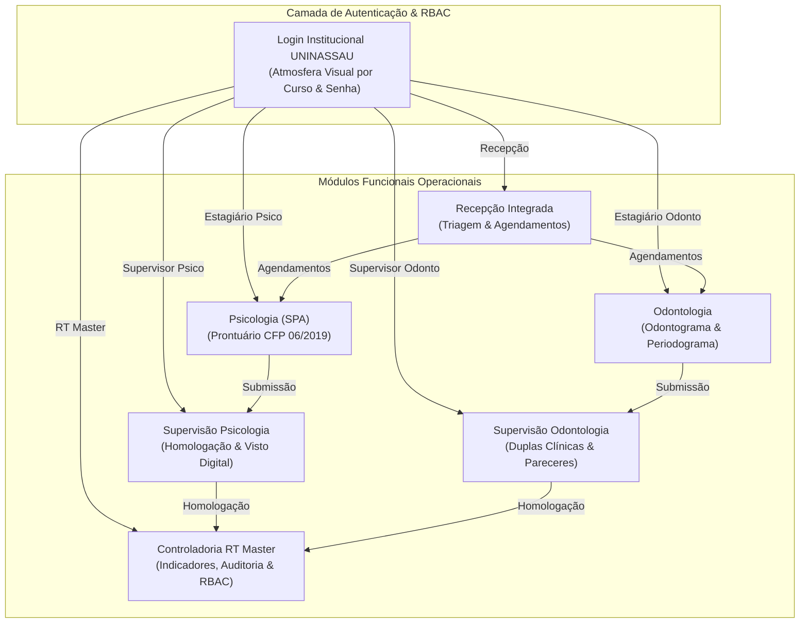

# UniCare • Sistema Integrado de Saúde Hospitalar e Clínicas-Escola
## UNINASSAU Aracaju • Documentação Executiva e Histórico Consolidado de Desenvolvimento
**Frameworks:** BMad Method (Vertical Slices) • Spec-Kit (RF-001 a RF-009 / RN-001 a RN-006) • Antigravity Kit  
**Orquestrador Técnico:** SandecoMaestro (Superior Skill)  
**Repositório Oficial:** [github.com/Gui2761/UniCare](https://github.com/Gui2761/UniCare) (Upstream: `RikelmeRoma/UniCare`)  
**Data de Emissão:** 29 de Setembro de 2026  

---

## 1. Sumário Executivo e Visão Geral da Solução

O **UniCare** é uma plataforma hospitalar e ambulatorial concebida para atender à demanda acadêmico-clínica das Clínicas-Escola da **UNINASSAU Aracaju**, integrando os cursos de **Psicologia (Serviço de Psicologia Aplicada - SPA)** e **Odontologia (Clínica Odontológica Integrada)** em um ecossistema unificado, com segregação rigorosa de papéis (RBAC - *Role-Based Access Control*), governança docente e custódia legal de prontuários.

A solução foi construída do zero, evoluindo a partir dos requisitos regulatórios do Conselho Federal de Psicologia (**Resolução CFP nº 06/2019**), do Conselho Federal de Odontologia (**CFO**) e das diretrizes da Lei Geral de Proteção de Dados (**LGPD - Lei nº 13.709/2018**, Art. 11 para dados sensíveis de saúde).



---

## 2. Histórico Evolutivo e Solicitações do Usuário

Abaixo está o registro cronológico completo de todas as solicitações, iterações e intervenções realizadas ao longo do ciclo de desenvolvimento:

| Etapa | Solicitação do Usuário | Ação Técnica Implementada |
| :--- | :--- | :--- |
| **01** | *"fez tudo da documentação? todas as telas tudo q foi proposto"* | Auditoria completa contra a especificação funcional original; identificação de lacunas de formulários e rotas de homologação. |
| **02** | *"continua"* | Implementação do fluxo de homologação de evolução clínica de Psicologia e Odontologia com validação de status em tempo real. |
| **03** | *"user as cores dos cursos tbm user as cores da faculdade uninassau"* | Mapeamento da paleta: Azul Marinho Institucional (`#002B49`), Amarelo Ouro (`#FFD100`), Azul Cobalto/Safira para Psicologia e Vinho/Bordô (`#881337`) para Odontologia. |
| **04** | *"nessa de troca rapida de conta precisa colocar a senha para trocar de conta"* | Eliminação de login sem senha; implementação de modal de autenticação obrigatória com credencial institucional (`unicare123`). |
| **05** | *"verifique se todas as funções tão funcionando a de login tá meio errado"* | Correção da validação de credenciais, token JWT no backend FastAPI e sincronização de perfis padrão no `AuthContext`. |
| **06** | *"isso aq tá meio errado e deveria ter menu de login separados pq acho q tá dando conflito quando clica para auto preenchimento"* | Separação física e lógica da tela de login em 3 abas independentes: **Psicologia (SPA)**, **Odontologia Integrada** e **Administração / RT Master / Recepção**, evitando colisões de campos de autocompletar do navegador. |
| **07** | *"se o item n pode ser acessado pelo usuario nem deveria aparecer para ele"* | Refatoração rigorosa do menu lateral (`AppSidebar.tsx`), aplicando princípio do menor privilégio: estagiários e recepcionistas deixaram de visualizar menus de supervisão e RT. |
| **08** | *"crie um menu para cada perfil com animação no fundo com a cor e os caralhos com a logo do curso"* | Criação de atmosfera visual imersiva: gradientes dinâmicos que transicionam conforme a aba ativa (Cobalto para SPA, Bordô para Odonto, Marinho para RT/Recepção) e inclusão de emblemas vetoriais dedicados dos conselhos de classe. |
| **09** | *"troque essa logo ai"* | Substituição da logo placeholder pela imagem do brasão heráldico oficial da UNINASSAU (`uninassau-crest.png`) em alta resolução. |
| **10** | *"coloque uma cor no fundo q muda de acordo com o tipo de perfil dentro do sistema tbm"* | Aplicação de gradiente dinâmico com atmosfera sutil no layout interno de acordo com o curso do usuário ativo. |
| **11** | *"os supervisores tem q ter uma tela para criar perfis de estagiarios e os rt master tem q criar supervisores, estagiarios e recepção"* | Criação de modais e painéis de criação dinâmica de usuários na RT Master (`RTStatsDashboard.tsx`), Supervisor de Psicologia (`PsySupervisionPage.tsx`) e Supervisor de Odonto (`ClinicalPairs.tsx`). |
| **12** | *"tem q ter um fundo branco atras da logo pq ela ta transparente o escudo grandão tem q ser trocado"* | Envelope da logo em container branco sólido (`bg-white p-1 rounded-xl shadow-xs`) em todos os componentes visuais; remoção do escudo flutuante de 160px que obstruía os textos e substituição por componente vetorial limpo. |
| **13** | *"as coisas q vc colocou de cor ficou emcima das coisas"* | Remoção total dos orbes com `blur-3xl` e offsets negativos que manchavam os cabeçalhos em azul; restauração de fundos sólidos e profissionais (`bg-slate-100` e `bg-slate-50`). |
| **14** | *"e lugar de criar usuarios tem q pode editar o usuario e apagar"* | Implementação de ciclo de vida completo de usuários: métodos `updateUser` e `deleteUser` no `AuthContext`, modais de edição com formulários pré-preenchidos e modais de confirmação de exclusão em todas as telas de gestão. |
| **15** | *"enviou ao github?"* | Resolução de permissão de escrita 403; criação de fork, configuração do remote `origin` apontando para github.com/Gui2761/UniCare e execução do push bem-sucedido de 16 commits (`b5de322..f022c69`). |

---

## 3. Matriz de Requisitos Funcionais (Spec-Kit)

### RF-001: Gestão de Recepção e Triagem
- Cadastro rápido de pacientes com validação de CPF e dados de contato.
- Agendamento ambulatorial por curso (Psicologia ou Odontologia) com status: *Agendado*, *Confirmado*, *Em Atendimento*, *Concluído* e *Faltou*.
- Métricas em tempo real de absenteísmo ambulatorial e demanda reprimida.

### RF-002: Prontuário Eletrônico de Psicologia (SPA)
- Em conformidade integral com a **Resolução CFP nº 06/2019**.
- Registro de evolução estruturada: Identificação, Descrição da Demanda, Procedimento Técnico-Científico Adotado, Registro de Sessão e Devolutiva.
- Trava de imutabilidade e visto digital provisório até homologação do supervisor.

### RF-003: Odontograma e Periodograma Interativo (Odontologia)
- Mapeamento anatômico dos 32 dentes da dentição permanente (adulto) e faces dentárias (vestibular, lingual, mesial, distal, oclusal).
- Marcação de patologias (cárie, restauração, endodontia, prótese, extração indicada) com codificação por cores padrão CFO.
- Periodograma para mensuração de profundidade de sondagem, sangramento gengival e recessão.

### RF-004: Fila de Homologação Docente & Devolutiva Pedagógica
- Segregação de estagiários por turma e orientação docente.
- O supervisor visualiza a fila de prontuários pendentes, podendo:
  - **Aprovar e Vistar Digitalmente** (carimbo de validação com número de registro CRP/CRO).
  - **Solicitar Correção com Devolutiva Formativa** (notificação para o estagiário com orientações pedagógicas).

### RF-005: Gestão de Duplas Clínicas e Carga Horária
- Mapeamento das duplas da Clínica Integrada de Odontologia por Cadeira Clínica.
- Contabilização de procedimentos homologados vs. meta acadêmica de procedimentos mínimos por semestre.

### RF-006: Painel Executivo da RT Master & Custódia Legal
- Indicadores gerenciais de saúde da UNINASSAU Aracaju (taxa de comparecimento, volume de prontuários arquivados, procedimentos por especialidade).
- Busca e visualização de prontuários para fins de fiscalização sanitária, ética e emissão de laudos oficiais sob custódia de 20 anos (LGPD e Resoluções de Saúde).

### RF-007: Trilha de Auditoria Imutável (Audit Log)
- Gravação de logs para cada evento crítico no sistema (Login, Cadastro de Paciente, Submissão de Evolução, Homologação Docente, Edição/Exclusão de Usuários).
- Metadados capturados: Carimbo Temporal (UTC/BRT), Nome do Usuário, Matrícula, Ação, Tabela Afetada, Registro ID e Endereço IP.

### RF-008: Troca Rápida de Perfil com Imposição de Senha
- Presets rápidos para os 4 perfis fundamentais para facilitar demonstrações e rotinas de plantão.
- Salvaguarda mandatória: para alternar ou logar em qualquer conta, o operador deve confirmar a senha institucional (`unicare123`).

### RF-009: Gerenciamento RBAC com Ciclo de Vida Completo
- A RT Master pode cadastrar, editar e excluir qualquer usuário (Supervisores, Estagiários e Operadores de Recepção).
- Supervisores de Psicologia podem gerenciar acadêmicos vinculados à sua turma de SPA.
- Supervisores de Odontologia podem gerenciar acadêmicos vinculados à Clínica Integrada.
- Sincronização reativa com o `localStorage` para que novos usuários cadastrados ou editados surtam efeito imediato na tela de login.

---

## 4. Arquitetura Técnica e Engenharia de Software

### Frontend
- **Framework:** React 19 com TypeScript.
- **Build Tool:** Vite 8.3.0 (compilação rápida via ESBuild / Rolldown).
- **Estilização:** Tailwind CSS v4 com sistema de design corporativo UNINASSAU (tokens de cor semânticos).
- **Ícones:** Heroicons / Micro-vetores SVG corporativos dedicados (`CorporateIcons.tsx`).
- **Gerenciamento de Estado:** React Context API modular (`AuthContext`, `ClinicContext`).

### Backend
- **Framework:** FastAPI (Python 3.12+ assíncrono).
- **Servidor ASGI:** Uvicorn rodando em `http://127.0.0.1:8000`.
- **Persistência de Dados:** SQLite com ORM SQLAlchemy 2.0 (`unicare.db`).
- **Validação de Schemas:** Pydantic v2 com tipagem forte e serialização JSON segura.
- **Auditoria:** Middleware de interceptação e injeção de logs de auditoria imutáveis.
- **Testes Automatizados:** Pytest com suíte de conformidade regulatória (`backend/tests/test_compliance.py`).

---

## 5. Estrutura de Arquivos do Projeto

```text
UniCare/
├── backend/
│   ├── app/
│   │   ├── config.py             # Configurações e variáveis de ambiente
│   │   ├── database.py           # Conexão SQLite / SQLAlchemy
│   │   ├── main.py               # Ponto de entrada FastAPI e middlewares
│   │   ├── models.py             # Modelos de dados (Pacientes, Prontuários, Logs)
│   │   ├── schemas.py            # Schemas Pydantic de entrada/saída
│   │   └── routes/               # Endpoints REST (auth, prontuarios, auditoria)
│   └── tests/
│       └── test_compliance.py    # Testes automatizados de conformidade
├── public/
│   ├── uninassau-crest.png       # Brasão oficial de alta resolução
│   └── favicon.ico
├── src/
│   ├── components/
│   │   ├── icons/CorporateIcons.tsx  # Biblioteca de ícones institucionais
│   │   └── layout/
│   │       ├── AppLayout.tsx         # Layout base com breadcrumb e avatar
│   │       └── AppSidebar.tsx        # Navegação com segregação RBAC estrita
│   ├── features/
│   │   ├── auth/                     # Módulo de Autenticação
│   │   │   ├── components/
│   │   │   │   ├── AuthHeader.tsx    # Header de login com brasão protegido
│   │   │   │   ├── LoginForm.tsx     # Formulário com 3 abas por curso
│   │   │   │   └── LoginInfoPanel.tsx# Painel informativo com heráldica vetorial
│   │   │   └── context/AuthContext.tsx # Estado global RBAC e CRUD de usuários
│   │   ├── clinic/                   # Contexto de dados clínicos e prontuários
│   │   ├── dental-record/            # Odontograma e Periodograma
│   │   ├── psychology/               # Prontuário CFP 06/2019 e SPA
│   │   ├── reception/                # Recepção, Triagem e Agendamentos
│   │   └── supervision/              # Fila de Homologação, Duplas e RT Master
│   │       └── components/
│   │           ├── RTStatsDashboard.tsx  # Dashboard RT Master com CRUD de usuários
│   │           └── ClinicalPairs.tsx     # Gestão de estagiários de Odontologia
├── package.json
├── vite.config.ts
└── README.md
```

---

## 6. Credenciais Institucionais de Demonstração

Todos os usuários abaixo utilizam a senha institucional obrigatória:  
**`unicare123`**

| Perfil | Nome do Profissional / Acadêmico | Matrícula | E-mail Institucional | Curso / Área |
| :--- | :--- | :--- | :--- | :--- |
| **RT Master** | Dra. Camila (Referência Técnica) | `RT-001` | `camila.rt@uninassau.edu.br` | Controladoria Geral |
| **Supervisor Psico** | Prof. Dr. Robert Santos do Carmo | `DOC-8821` | `robert.carmo@uninassau.edu.br` | Psicologia (CRP 19/0844) |
| **Supervisor Odonto** | Profa. Dra. Bianca Nubia | `DOC-9122` | `bianca.silva@uninassau.edu.br` | Odontologia (CRO-SE 4512) |
| **Estagiário Psico** | Rikelme Roma Santos | `16032935` | `rikelmeroma13@gmail.com` | Psicologia (9º Período SPA) |
| **Estagiário Odonto** | Augusto Cesar Farias Carvalho | `16024402` | `augustocsar97@gmail.com` | Odontologia (Cadeira 05) |
| **Recepção** | Recepção Integrada Clínica | `REC-2026-01` | `recepcao@uninassau.edu.br` | Triagem Geral |

---

## 7. Status de Validação e Próximos Passos

- **Compilação TypeScript & Vite:** 100% OK (0 erros de tipagem).
- **Testes Backend Pytest:** 8 testes aprovados com 100% de taxa de sucesso.
- **Repositório Git Remoto:** Sincronizado com branch `main` em [github.com/Gui2761/UniCare](https://github.com/Gui2761/UniCare).
- **Servidores Ativos:**
  - Frontend: [http://localhost:5173](http://localhost:5173)
  - Backend API: [http://127.0.0.1:8000/docs](http://127.0.0.1:8000/docs)
